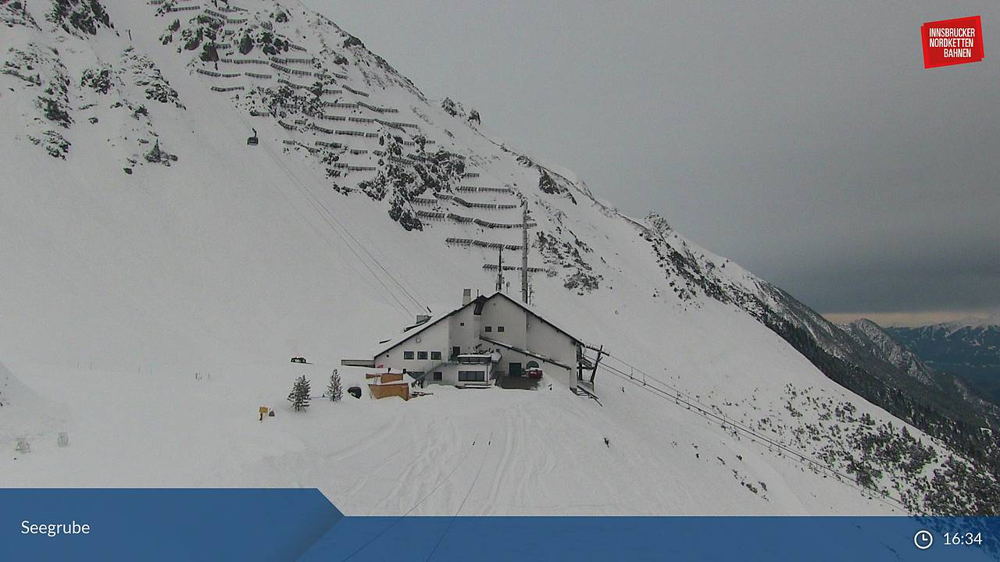

# Beispiel 1

## warum wir git verwenden

1. temafähig
1. backup
1. zurück zu einer vorigen Version

## nächster Kurs HTML

## Bilder und Links

Quelle: [Bild von der Seegrube](http://www.bergfex.at/innsbruck-nordkette/webcams/c8214/)